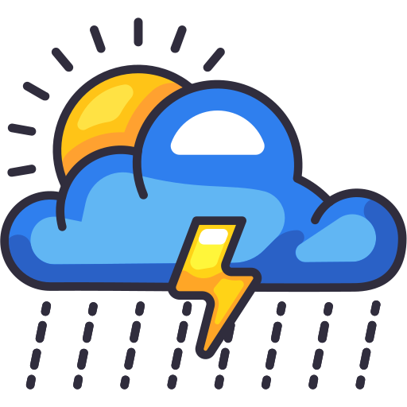

# <h1 align='center'> Daily Weather Report </h1>

       

<b>Display GitHub Action Badge</b> 

<a href="https://github.com/Julius-Ulee/Daily-Weather-Report/blob/main/README.md">Readme</a> • <a href="https://github.com/Julius-Ulee/Daily-Weather-Report/blob/main/.github/workflows/weather.yml">Weather-YML</a> • <a href="https://github.com/Julius-Ulee/Daily-Weather-Report/blob/main/scripts/update_readme.sh">update-readme</a> • <a href="https://github.com/Julius-Ulee/Daily-Weather-Report/blob/main/weather.json">Weather Data</a>

<h3 align='center'>🕒 Indonesian Time(UTC+7.00): <u>2024-05-18 18:09:04 WIB</u> (🤖Automated)</h3>

<table align='center'>
<tr>
<td align='center'> <b>Pasir Gunung Selatan</b> <b>Latitude: -6.3594 Longitude: 106.8461</b>  <b>31.59°C</b>  <b>Clouds</b> <b>(scattered clouds)</b> <b>Feels Like: 34.81°C <b>Wind Direction: East</b></b></td>
</tr>
<td>
<table>
<tr>

</tr>
<tr>
<td align='center'> Minimum Temperature: <b>29.61°C</b></td>
<td align='center'> Maximum Temperature: <b>31.71°C</b></td>
</tr>
<tr>
<td align='center'> Humidity: <b>55%</b></td>
<td align='center'> Atmospheric Pressure: <b>1006 hPa</b></td>
</tr>
<tr>
<td align='center'> Wind Speed: <b>5.14 m/s</b> </b></td>
<td align='center'> Wind Direction: <b>80°</b></td>
</tr>
<tr>
<td align='center'> Cloudiness: <b>40%</b></td>
<td align='center'> Visibility: <b>6000 Meters</b></td>
</tr>
<tr>
<td align='center'> Sunrise: <b>2024-05-18 05:54:43</b></td>
<td align='center'> Sunset: <b>2024-05-18 17:43:38</b></td>
</tr>
</table>
</table>
<h2 align=center> Next 24 Hours</h2>
<table align=center>
<tr>
<td align=center><b>31.59°C</b>  <b>Rain</b> <b>19:00</b></td>
<td align=center><b>30.24°C</b>  <b>Rain</b> <b>22:00</b></td>
<td align=center><b>28.32°C</b>  <b>Clouds</b> <b>01:00</b></td>
<td align=center><b>26.26°C</b>  <b>Clouds</b> <b>04:00</b></td>
<td align=center><b>26.91°C</b>  <b>Clouds</b> <b>07:00</b></td>
<td align=center><b>30.81°C</b>  <b>Clouds</b> <b>10:00</b></td>
<td align=center><b>33.28°C</b>  <b>Rain</b> <b>13:00</b></td>
<td align=center><b>30.92°C</b>  <b>Rain</b> <b>16:00</b></td>
</tr>
</table>
